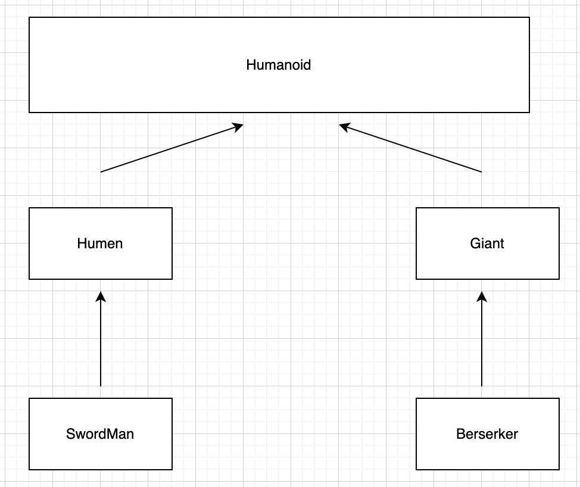

# Lab04

# SuperType : Humanoid

## Operations

levelUp = เพิ่ม level ให้ตัวละคร

Attack = โจมตีตัวละครอื่น

beAttck = เป็นฟั่งชั่นที่รับการโจมตี

CalDmg = คำนวณดาเมทที่โดน (maby Defaulte )

getHp = แสดงเลือดที่มีอยู่

getMana = แสดงมานาที่มีอยู่

---

## Class Character 1: [Human] implement Humanoid

## Operation

| levelUp | เวลของ Hument จะทำการเพิ่ม  Stat ทุกอย่างที่เขามี |
| --- | --- |
| Attack | จะทำการโจมตี เเต่ ต้องมีดาบถึงจะตีได้เท่านั้น !!!  |
| beAttck | เป็นฟั่งชั่นที่รับการโจมตี โดยสุ่มการโดนตี Crite |
| CalDmg | คำนวณดาเมท ที่โดน โดยเอาเกราะมาหักกับดาเมทด้วย |
| getHp | ส่งค่าเลือดของตัวละคร |
| getMana | ส่งค่าเลือดของตัวละคร |

---

## Class  Character 2: [Giant] implement Humanoid

## Operation

| levelUp | เวลของ  Giant จะทำการเพิ่ม  Stat ของ Strength , HP , MP , Stamina เเต่ไม่เพิ่ม Intelligence และ Dexterity |
| --- | --- |
| Attack | จะทำการโจมตีโดยไม่ต้องมีอาวุธก็ได้ |
| beAttck | เป็นฟั่งชั่นที่รับการโจมตี โดยจะสุ่มที่จะตีไม่โดน |
| CalDmg | คำนวณดาเมจที่โดน  |
| getHp | ส่งค่าเลือดของตัวละคร |
| getMana | ส่งค่าเลือดของตัวละคร |

---

## Class SwordMan extend Human

| Attribute | Description |
| --- | --- |
| Name | ชื่อของตัวละคร |
| Level | เลเวลของตัวละคร |
| HP | เลือดของตัวละคร |
| MaxHP | เลือดตัวละครที่มากที่สุด |
| MP | มานาของตัวละคร |
| MaxMP | มานาที่มากที่สุด |
| Strength | ตวามแข็งเเรงของตัวละคร |
| speed | ความว่องไวของตัวละคร |
| MaxSpeed | ความเร็วมากที่สุด |
| Intelligence | ความฉลาดของตัวละคร |
| Stamina | ความอึดของตัวละคร |
| Equipped Accessories | อุปกรณ์ที่ใส่ |

## Operation

| levelUp | เวลของ Hument จะทำการเพิ่ม  Stat ทุกอย่างที่เขามี |
| --- | --- |
| Attack | จะทำการโจมตี เเต่ ต้องมีดาบถึงจะตีได้เท่านั้น !!!  |
| beAttck | เป็นฟั่งชั่นที่รับการโจมตี โดยสุ่มการโดนตี Crite |
| CalDmg | คำนวณดาเมท ที่โดน โดยเอาเกราะมาหักกับดาเมทด้วย |
| getHp | ส่งค่าเลือดของตัวละคร |
| getMana | ส่งค่าเลือดของตัวละคร |
| EquipAccessories | ใส่อุปกรณ์ |
| UnEquipAccessories | ถอดอุปกรณ์ |

---

## Class Berserk extend Giant

| Attribute | Description |
| --- | --- |
| Name | ชื่อของตัวละคร |
| Level | เลเวลของตัวละคร |
| HP | เลือดของตัวละคร |
| MP | มานาของตัวละคร |
| Strength | ตวามแข็งเเรงของตัวละคร |
| Dexterity | ความว่องไวของตัวละคร |
| Intelligence | ความฉลาดของตัวละคร |
| Stamina | ความอึดของตัวละคร |
| Equipped Accessories | อุปกรณ์ที่ใส่ |

## Operation

| levelUp | เวลของ  Giant จะทำการเพิ่ม  Stat ของ Strength , HP , MP , Stamina เเต่ไม่เพิ่ม Intelligence และ Dexterity |
| --- | --- |
| Attack | จะทำการโจมตีโดยไม่ต้องมีอาวุธก็ได้ |
| beAttck | เป็นฟั่งชั่นที่รับการโจมตี โดยจะสุ่มที่จะตีไม่โดน |
| CalDmg | คำนวณดาเมจที่โดน  |
| getHp | ส่งค่าเลือดของตัวละคร |
| getMana | ส่งค่าเลือดของตัวละคร |
| EquipAccessories | ใส่อุปกรณ์ |
| UnEquipAccessories | ถอดอุปกรณ์ |

---

# SuperType of Accessory

GiveEffect จะมอบ Effect อะไรให้ผู้ใส่

## Class Accessory 1: [สร้อยคอ] impement Accessory

| Attribute | Description |
| --- | --- |
| Name | ชื่อของ เเหวน |
| Type | ของส่วมใส่เป็น Type ไหน |
| Effect | ให้ Effect อะไรกับผู้ใส่ |

## Operation

| GiveEffect | จะเพิ่ม HP เเต่ลด Dexterity |
| --- | --- |

## Class Accessory 2: [เเหวน]  impement Accessory

| Attribute | Description |
| --- | --- |
| Name | ชื่อของ รองเท้า |
| Type | ของส่วมใส่เป็น Type ไหน |
| Effect | ให้ Effect อะไรกับผู้ใส่ |

## Operation

| GiveEffect | จะเพิ่ม Dexterity กับ Stamina |
| --- | --- |

